# Bot Calendario de Telegram

[](https://travis-ci.org/lulivi/bot-calendario-telegram) [](https://codecov.io/gh/lulivi/bot-calendario-telegram)

## Índice

<!-- TOC depthFrom:3 depthTo:6 withLinks:1 updateOnSave:0 orderedList:1 -->

1. [Descripción](#descripción)
2. [Servicios](#servicios)
3. [Despliegue en Heroku](#despliegue-en-heroku)
	1. [Configuración de la aplicación](#configuración-de-la-aplicación)
	2. [Creación de la aplicación en heroku](#creación-de-la-aplicación-en-heroku)
	3. [Configuración de la aplicación](#configuración-de-la-aplicación)
	4. [Desplegado de la aplicación](#desplegado-de-la-aplicación)
4. [Despliegue con Docker en Zeit](#despliegue-con-docker-en-zeit)
5. [Despliegue con una máqina virtual en Azure](#despliegue-con-una-máqina-virtual-en-azure)
6. [Licencia](#licencia)

<!-- /TOC -->

### Descripción

Este proyecto consiste en la creación y desplegado de un bot de telegram multiuso, especialmente centrado en el manejo de un calendario de eventos añadidos por el usuario. Su principal misión será notificar las fechas de entregas de prácticas o exámenes. Un posible borrador de las acciones que podrá llevar a cabo el bot podría ser:

* Añadir nuevos eventos
* Modificar eventos
* Eliminar eventos
* Configurar cuándo deben notificar de los eventos

### Servicios

Los posibles servicios en los que se basará este bot serán:

* Bot API: [python-elegram-bot API](https://github.com/python-telegram-bot/python-telegram-bot)
* Lenguaje: [Python](https://www.python.org/) será el principal lenguaje del proyecto.
* Cloud: Será desplegado en [Heroku](http://heroku.com/) por su facilidad de uso y existencia de versión gratuita.
* Base de datos: [PostgreSQL](https://www.postgresql.org/) se utilizará como base de datos por su integración con heroku y versatilidad.

### Despliegue en Heroku

Para el despliegue de la aplicación he utilizado heroku como ya he comentado en la sección anterior. Los pasos a seguir son los siguientes:

#### Configuración de la aplicación

Antes de crear la aplicación en heroku, tenemos que configurar algunas opciones para que el desplegado se realiza automáticamente.

- `app.json`: Este archivo (aunque no es totalmente necesario para este despliegue simple) definirá las características de nuestra aplicación  a la hora del despliegue (por ejemplo, ejecución de scripts para la creación de la base de datos).
- `Procfile`: El archivo que le dice a heroku qué debe ejecutar cuando se llega a la etapa de desplegado. Está compuesto por una o varias lineas indicándo qué servicios se desplegaran en la aplicación.

#### Creación de la aplicación en heroku

Una vez nos hemos hecho cuenta en [heroku](https://signup.heroku.com/):

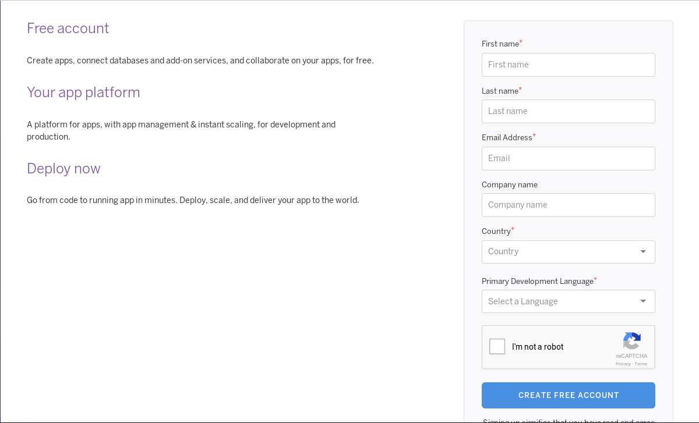

Posteriormente, creamos una nueva app en nuestro [panel de aplicaciones](https://dashboard.heroku.com/apps):

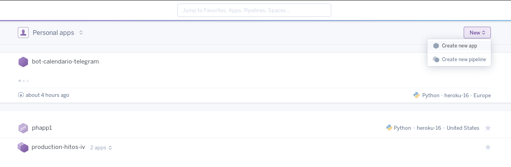

Introducimos el nombre y la región en la que queremos que se ejecute:


#### Configuración de la aplicación

Después de crear la aplicación, configuramos su conexión con github y le indicamos que queremos desplegado automático despues de pasar los tests:


#### Desplegado de la aplicación

Clicamos en el boton de desplegar de la imagen anterior y... ¡configuración terminada!

En el siguiente enlace podemos encontrar el despliegue:

Despliegue https://bot-calendario-telegram.herokuapp.com/

Si quieres desplegar tu propia aplicación con este código:

[](https://heroku.com/deploy?template=https://github.com/lulivi/bot-calendario-telegram)

### Despliegue con Docker en Zeit

Una vez nos hemos registrado en [Zeit](https://zeit.co/) hay dos maneras de desplegar la aplicación.

1. [Forma lenta](https://zeit.co/docs/deployment-types/docker#built-in-the-cloud): Crear un Dockerfile en tu proyecto con la configuración pertinente
2. [Forma rápida](https://zeit.co/docs/deployment-types/docker#accelerating-builds): Crear un Dockerfile con una snapshot de tu proyecto ya subida a [DockerHub](https://hub.docker.com)

Y finalmente utilizar la herramienta de Zeit ([now](https://zeit.co/download#command-line)).

	$ now --public
	> Deploying ~/git/bot-calendario-telegram under lulivi
	> Ready! https://bot-calendario-telegram-xfalnttusx.now.sh [9s]
	> Synced 26 files (269.08KB) [0ms]
	> Initializing…
	> Building
	> ▲ docker build
	Sending build context to Docker daemon 344.1 kBkB
	> Step 1 : FROM python:3.6
	> 3.6: Pulling from library/python
	...
	> Successfully built 265dc9f7110a
	> ▲ Storing image
	> ▲ Deploying image
	> ▲ Container started
	> Deployment complete!

El despliegue del contenedor se puede encontrar en la siguiente URL de Zeit:

Contenedor: https://bot-calendario-telegram-xfalnttusx.now.sh

La snapshot se puede encontrar en DockerHub:

DockerHub snapshot: https://hub.docker.com/r/lulivi/bot-calendario-telegram/

### Despliegue con una máqina virtual en Azure

La cuenta de azure la he obtenido de una clave que me proporcionó el profesor. Una vez registrados en [Azure](https://azure.microsoft.com/en-us/), instalamos un cliente de azure (yo he elegido el de python):

```bash
sudo npm install -g azure-cli
```

Una vez instalada la herramienta debemos reiniciar el equipo para que podamos usarla. Una vez reiniciado, ejecutamos:

```bash
azure login
```

Y nos mandará abrir un enlace y pegar el código de inicio de sesión con el cliente:

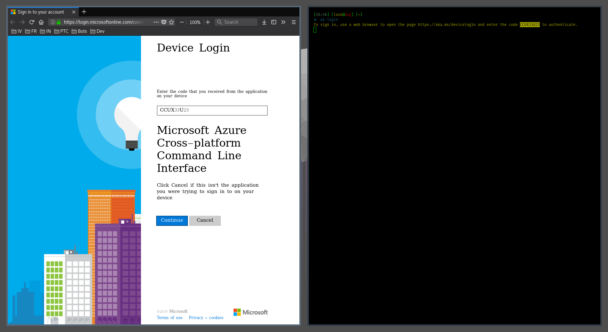

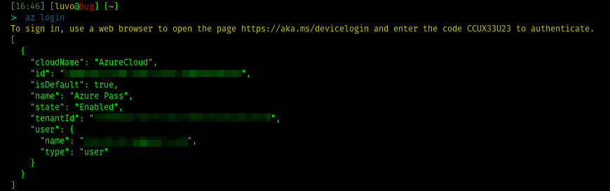

Para aprovisionar las máquinas de azure, utilizaré [vagrant](https://www.vagrantup.com/) con su plugin de [vagrant-azure](https://github.com/Azure/vagrant-azure) que veremos más adelante. Ahora, realizamos la configuración de credenciales para conectarnos con azure siguiendo la siguiente guía [configuración de credenciales con azure](https://unindented.org/articles/provision-azure-boxes-with-vagrant/).

Entramosen modo asm (service management):

```bash
azure config mode asm
```

Ejecutamos el comando siguiente para poder crear nuestras credenciales:

```bash
azure account download
```

E importamos las credenciales descargadas (si no se nos lanza el buscador, copiamos y pegamos la url que aparece con el comando anterior en el), las importamos con:

```bash
azure account import /path/to/download/*.publishsettings
```

Una vez importadas las credenciales, las borramos y ejecutamos los siguientes comandos para su configuración:

```bash
openssl req -x509 -nodes -days 365 -newkey rsa:2048 \
-keyout ~/.ssh/azurevagrant.key -out ~/.ssh/azurevagrant.key

chmod 600 ~/.ssh/azurevagrant.key

openssl x509 -inform pem -in ~/.ssh/azurevagrant.key -outform der -out ~/.ssh/azurevagrant.cer
```

Una vez configuradas, subimos el archivo .cert a Azure (Suscriptions > <Suscripción activa> > Management certificates > Upload). Ahora, creamos la aplicación y le damos permisos de colaborador (nos ahorrará muchos quebraderos de cabeza).

Nos dirigimos a `Azure Active Directory > App registrations > New Application registration`
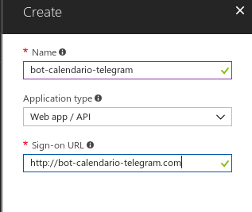

Despues en `Subscriptions > <Active Azure Pass> > Access control (IAM) > Add` añadimos a nuestra aplicación y a nosotros como colaboradores
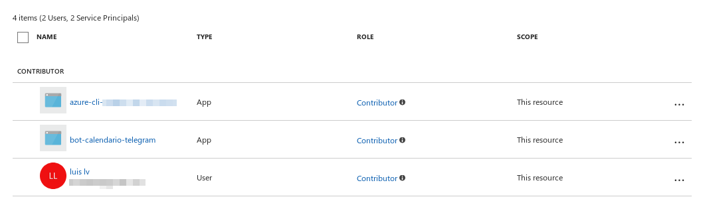

Vamos a utilizar Vagrant para la creación de la máquina virtual donde se encontrará nuestra aplicación. Para instalarlo, usamos los repositorios oficiales:

```bash
sudo pacman -S vagrant
```

Instalamos el plugin de azure para vagrant:

```bash
vagrant plugin install vagrant-azure
```

Tras la instalación, necesitamos las claves de nuestra aplicación para nuestro `Vagrantfile`. Se puede obtener como dice la [guía de Azure](https://docs.microsoft.com/es-es/azure/azure-resource-manager/resource-group-create-service-principal-portal):

El ID de la aplicación en `Azure Active Directory > App registrations > <Nombre de la aplicacion> > Application ID`
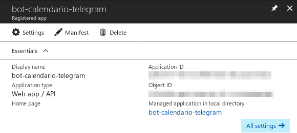

La contraseña de la aplicación en `Azure Active Directory > App registrations > <Nombre de la aplicacion> > Settings > API ACCESS - Keys > Password` creando una
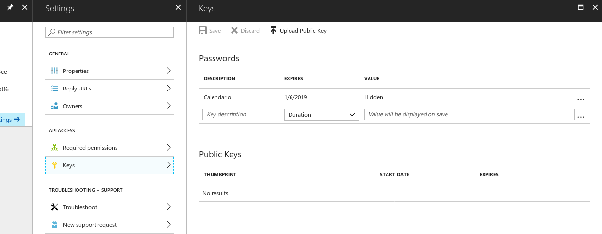

La ID del directorio donde se encuentra la aplicación `Azure Active Directory > Properties > Directory ID`
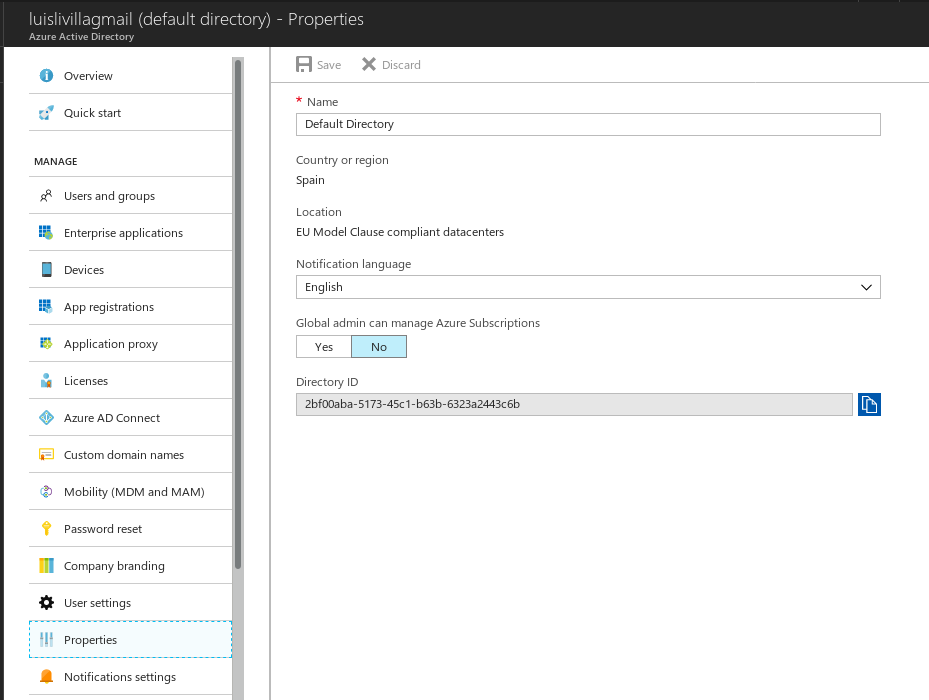

La ID de la subscripción activa en `Suscriptions > <Active Azure Pass> > Suscription ID`
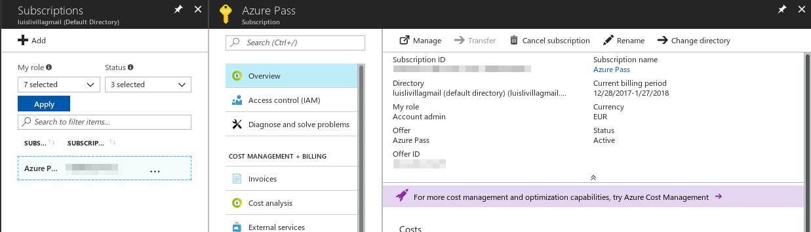

Para aprovisionar nuestra máquina, voy a usar un software que lo hace automáticamente tras la ejecución de vagrant. Éste es [ansible](https://www.ansible.com/). Se instala desde los repositorios oficiales, como vagrant:

```bash
sudo pacman -S ansible
```

Ahora creamos los archivos [var.yml](./provisioning/var.yml) y [playbook.yml](./provisioning/playbook.yml) necesarios para ansible.

Despues de completar el archivo [Vagrantfile](./vagrantfile) subimos la maquina:

```bash
vagrant up --provider=azure
```

Si se quisiera reaprovisionar la máquina virtual una vez ya se ha creado, se puede ejecutar el siguiente comando:

```bash
vagrant provision
```

Una vez se ha creada y aprovisionada la máquina con éxito, debemos abrir el puerto 80 de nuestra aplicación.

Nos dirigimos a `Virtual machines > <nuestra máquina> > Networking > INBOUND PORT RULES > Add inbound`
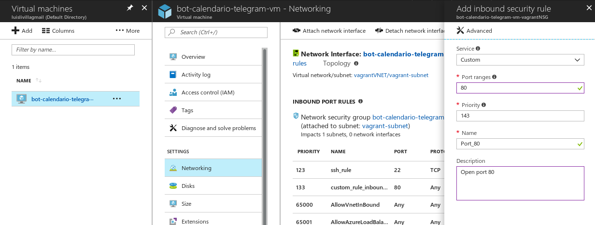

Finalmente, para poder desplegar nuestra aplicación con éxito, necesitamos una herramienta de despliegue. Yo voy a utilizar [fabric](https://github.com/mathiasertl/fabric/) y se instala desde pip:

```bash
pip install --user fabric3
```

Una vez creamos el archivo [fabfile](./deployment/fabfile.py), lo ejecutamos con los siguientes comandos para realizar el despliegue/ejecución exitosamente:

```bash
fab -H vagrant@bot-calendario-telegram-vm.southcentralus.cloudapp.azure.com InstallApp
fab -H vagrant@bot-calendario-telegram-vm.southcentralus.cloudapp.azure.com StartApp
```

Para la comodidad de despliegue completo de la aplicación, se puede usar un [script](./scripts/provisioning.sh).

Despliegue final: bot-calendario-telegram-vm.southcentralus.cloudapp.azure.com

### Licencia

Échale un vistazo a la [Licencia](https://github.com/lulivi/bot-calendario-telegram/blob/master/LICENSE)
