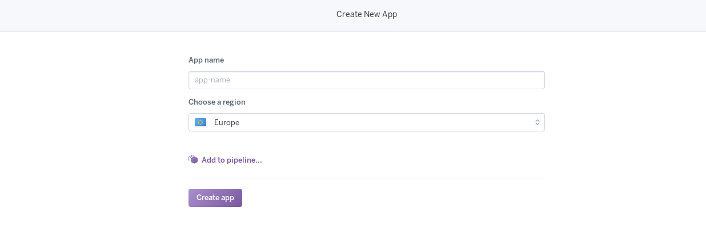
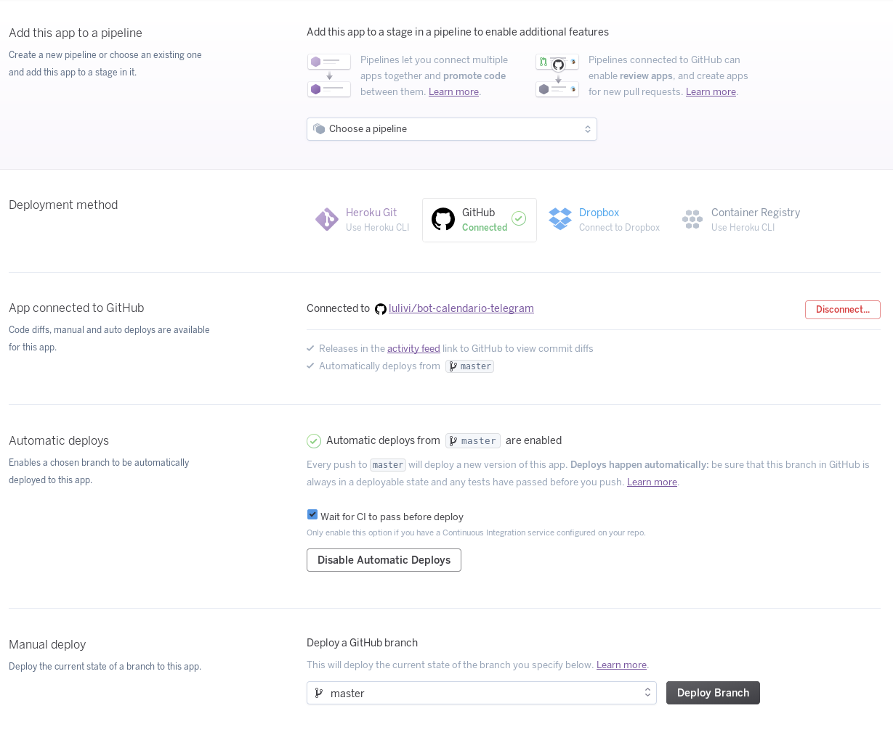

# Bot Calendario de Telegram

 

## Index

<!-- TOC depthFrom:3 depthTo:6 withLinks:1 updateOnSave:1 orderedList:1 -->

1. [Descripción](#descripción)
2. [Servicios](#servicios)
3. [Despliegue en Heroku](#despliegue-en-heroku)
	1. [Configuración de la aplicación](#configuración-de-la-aplicación)
	2. [Creación de la aplicación en heroku](#creación-de-la-aplicación-en-heroku)
	3. [Configuración de la aplicación](#configuración-de-la-aplicación)
	4. [Desplegado de la aplicación](#desplegado-de-la-aplicación)
4. [Despliegue con Docker en Zeit](#despliegue-con-docker-en-zeit)
5. [Licencia](#licencia)

<!-- /TOC -->

### Descripción

Este proyecto consiste en la creación y desplegado de un bot de telegram multiuso, especialmente centrado en el manejo de un calendario de eventos añadidos por el usuario. Su principal misión será notificar las fechas de entregas de prácticas o exámenes. Un posible borrador de las acciones que podrá llevar a cabo el bot podría ser:

* Añadir nuevos eventos
* Modificar eventos
* Eliminar eventos
* Configurar cuándo debe notificar de los eventos

### Servicios

Los posibles servicios en los que se basará este bot serán:

* Bot API: [python-elegram-bot API](https://github.com/python-telegram-bot/python-telegram-bot)
* Lenguaje: [Python](https://www.python.org/) será el principal lenguaje del proyecto
* Cloud: Será desplegado en [Heroku](http://heroku.com/) por su facilidad de uso y existencia de versión gratuita.
* Base de datos: [PostgreSQL](https://www.postgresql.org/) se utilizará como base de datos por su integración con heroku y versatilidad.

### Despliegue en Heroku

Para el despliegue de la aplicación he utilizado heroku como ya he comentado en la sección anterior. Los pasos a seguir son los siguientes:

#### Configuración de la aplicación

Antes de crear la aplicación en heroku, tenemos que configurar algunas opciones para que el desplegado se realiza automáticamente.

- `app.json`: Este archivo (aunque no es totalmente necesario para este despliegue simple) definirá las características de nuestra aplicación  a la hora del despliegue (por ejemplo, ejecución de scripts para la creación de la base de datos).
- `Procfile`: El archivo que le dice a heroku qué debe ejecutar cuando se llega a la etapa de desplegado. Está compuesto por una o varias lineas indicándo qué servicios se desplegaran en la aplicación.

#### Creación de la aplicación en heroku

Una vez nos hemos hecho cuenta en [heroku](https://signup.heroku.com/):

Posteriormente, creamos una nueva app en nuestro [panel de aplicaciones](https://dashboard.heroku.com/apps):

Introducimos el nombre y la región en la que queremos que se ejecute:

#### Configuración de la aplicación

Después de crear la aplicación, configuramos su conexión con github y le indicamos que queremos desplegado automático despues de pasar los tests:

#### Desplegado de la aplicación

Clicamos en el boton de desplegar de la imagen anterior y... ¡configuración terminada!

En el siguiente enlace podemos encontrar el despliegue:

Despliegue https://bot-calendario-telegram.herokuapp.com/

Si quieres desplegar tu propia aplicación con este código:

### Despliegue con Docker en Zeit

Una vez nos hemos registrado en [Zeit](https://zeit.co/) hay dos maneras de desplegar la aplicación.

1. [Forma lenta](https://zeit.co/docs/deployment-types/docker#built-in-the-cloud): Crear un Dockerfile en tu proyecto con la configuración pertinente
2. [Forma rápida](https://zeit.co/docs/deployment-types/docker#accelerating-builds): Crear un Dockerfile con una snapshot de tu proyecto ya subida a [DockerHub](https://hub.docker.com)

Y finalmente utilizar la herramienta de Zeit ([now](https://zeit.co/download#command-line)).

	$ now --public
	> Deploying ~/git/bot-calendario-telegram under lulivi
	> Ready! https://bot-calendario-telegram-xfalnttusx.now.sh [9s]
	> Synced 26 files (269.08KB) [0ms]
	> Initializing…
	> Building
	> ▲ docker build
	Sending build context to Docker daemon 344.1 kBkB
	> Step 1 : FROM python:3.6
	> 3.6: Pulling from library/python
	...
	> Successfully built 265dc9f7110a
	> ▲ Storing image
	> ▲ Deploying image
	> ▲ Container started
	> Deployment complete!

El despliegue del contenedor se puede encontrar en la siguiente URL de Zeit:

Contenedor: https://bot-calendario-telegram-xfalnttusx.now.sh

<<<<<<< HEAD
La snapshot se puede encontrar en DockerHub:

DockerHub snapshot: https://hub.docker.com/r/lulivi/bot-calendario-telegram/
=======
DockerHub snapshot:
>>>>>>> 27c854a963ae6956e137319985aaeb5cdc92497e

### Licencia

Échale un vistazo a la [Licencia](https://github.com/lulivi/bot-calendario-telegram/blob/master/LICENSE)
